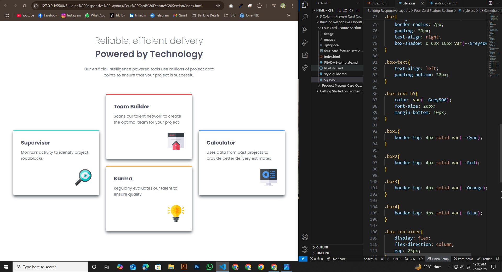

# Frontend Mentor - Four-Card-Feature-Section-Challenge

This is a solution to the [Four Card Feature Section Challenge](https://www.frontendmentor.io/learning-paths/building-responsive-layouts--z1qCXVqkD/steps/687161c8449a25f45b84df7a/challenge/start) on [Frontend Mentor](https://www.frontendmentor.io/). Frontend Mentor challenges help me improve my coding skills by building realistic projects.

## Table of contents

- [Overview](#overview)
  - [Screenshot](#screenshot)
  - [Project Links](#links)
- [My Process](#my-process)
  - [Built with](#built-with)
  - [What I learned](#what-i-learned)
  - [Continued development](#continued-development)
  - [Useful resources](#useful-resources)
- [Author](#author)
- [Acknowledgments](#acknowledgments)


## Overview

### Screenshot





### Links

- Solution URL: (https://github.com/hemal6325/Four-Card-Feature-Section-Challenge)
- Live Site URL: (https://hemal6325.github.io/Four-Card-Feature-Section-Challenge)

## My Process
I built this project using HTML and CSS, focusing on layout design and responsive styling. Through it, I learned Flexbox, Semantic Markup, and how to create visually balanced components.

### Built With

- HTML5 Semantic Structure
- CSS3 Custom Properties
- Flexbox
- Mobile First Workflow


### What I Learned

During this experience, I gained valuable skills and deeper understanding of the subject. It helped me improve my problem-solving abilities and boosted my confidence in applying new concepts.


```css

:root{
    --primaryFont: "Poppins", sans-serif;

    --fontSize: 15px;

    --Grey500: hsl(234, 12%, 34%);
    --Grey400: hsl(212, 6%, 44%);
    --White: hsl(0, 0%, 100%);

    --Red: hsl(0, 78%, 62%);
    --Cyan: hsl(180, 62%, 55%);
    --Orange: hsl(34, 97%, 64%);
    --Blue: hsl(212, 86%, 64%);
}

*,
*::after,
*::before{
    margin: 0;
    padding: 0;
    list-style: none;
    box-sizing: border-box;
}

html, body{
    height: 100%;
    width: auto;
}

body{
    font-size: var(--fontSize);
    font-family: var(--primaryFont);
    background-color: var(--White);
    color: var(--Grey400);
}

.container{
    max-width: 1200px;
    margin: 0 auto;
    padding: 50px 50px;
}

header{
    text-align: center;
}

header p{
    max-width: 500px;
    margin: 0 auto;
    font-weight: 400;
    margin-top: 20px;
}

header h3{
    font-size: 34px;
    font-weight: 600;
    color: var(--Grey500);
}

header h4{
    font-size: 34px;
    font-weight: 200;
    color: var(--Grey400);
}

.main{
    display: grid;
    grid-template-columns: 1fr 1fr 1fr;
    gap: 25px;
    margin-top: 60px;
}

.box{
    background-color: white;
    border-radius: 7px;
    padding: 30px;
    text-align: right;
    box-shadow: 0 6px 10px var(--Grey400);
}

.box-text{
    text-align: left;
    padding-bottom: 30px;
}

.box-text h5{
    color: var(--Grey500);
    font-size: 20px;
    margin-bottom: 10px;
}

.box1{
    border-top: 4px solid var(--Cyan);
}

.box2{
    border-top: 4px solid var(--Red);
}

.box3{
    border-top: 4px solid var(--Orange);
}

.box4{
    border-top: 4px solid var(--Blue);
}

.box-container{
    display: flex;
    flex-direction: column;
    gap: 25px;
}

.box1, .box4{
    align-self: center;
}

@media only screen and (max-width: 375px) {
    main{
        grid-template-columns: 1fr;
    }
}

```

### Continued Development

I would like to make my own QR Generator so this could be used as a default template. The qr code could be links to a document or something along those ways. Going to think about something useful that could come in handy.

### Useful Resources

- [FLEXBOX FROGGY](https://flexboxfroggy.com/) - This helped me to understand better how to use flexbox.


## Author

- Frontend Mentor - [@hemal6325](https://www.frontendmentor.io/profile/hemal6325)
- GitHub Profile - [@hemal6325](https://github.com/hemal6325/)

## Acknowledgments


At some point i was a little stuck with setting the style for the image. And i solved this problem using online Resources, ChatGPT & Google Bard.


**Have Fun Building!** 🚀
